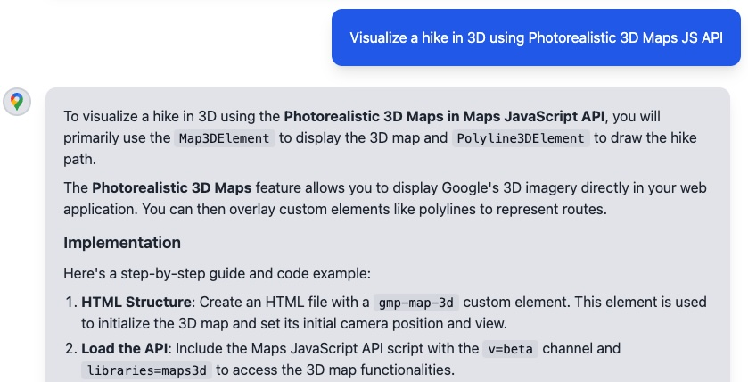

[][npm-pkg]

[][license]
[][Discord server]
[](https://cursor.com/en/install-mcp?name=google-maps-platform&config=eyJjb21tYW5kIjoibnB4IC15IEBnb29nbGVtYXBzL2NvZGUtYXNzaXN0LW1jcCJ9)
<a href="https://studio.firebase.google.com/new/gemini-maps">
  
</a>


#  Google Maps Platform Code Assist Toolkit 
*Alpha version*

<!-- [START maps_Description] -->
## Description

The Google Maps Platform Code Assist toolkit is a Model Context Protocol (MCP) server that enhances the responses from large language models (LLMs) used for developing applications with the Google Maps Platform by grounding the responses in the official, up-to-date documentation and code samples.

Since the MCP server accesses the content when the model is prompted, the LLM's context regarding Google Maps Platform does not have to be limited to the available data at the model's training date.

Google Maps Platform resources that the MCP server can access include:

- Google Maps Platform Documentation
- Google Maps Platform Terms of Service
- Google Maps Platform Trust Center
- Code repositories in Google Maps Platform official GitHub organizations
<!-- [END maps_Description] -->

<!-- [START maps_CTADevelopers] -->
## Developers

- 🪄 Make your favorite AI assistant or IDE a Google Maps Platform expert. With Code Assist, AI Agents like Gemini CLI, Claude Code, and Cursor can generate code and answer developer questions grounded in up-to-date, official Google Maps Platform documentation and code samples -- directly in your dev workflow.

- 🚀 Whether you are making precision AI-Assisted code changes or vibecoding a new app prototype - Code Assist can help you accomplish your task faster and easier.

Below is an example MCP Client response to a user's question with Code Assist MCP installed:

 

> [\!NOTE]
> This is the repository for an MCP server that provides access to Google Maps Platform documentation via a RAG service. It is not a Google Maps Platform Core Service.
<!-- [END maps_CTADevelopers] -->

-----

<!-- [START maps_Tools] -->
## 🔧 Tools Provided

The MCP server exposes the following tools for AI clients:

  1. **`retrieve-instructions`**: A helper tool used by the client to get crucial system instructions on how to best reason about user intent and formulate effective calls to the `retrieve-google-maps-platform-docs` tool.
  2. **`retrieve-google-maps-platform-docs`**: The primary tool. It takes a natural language query and submits it to a hosted Retrieval Augmented Generation (RAG) engine. The RAG engine searches fresh versions of official Google Maps Platform documentation, tutorials, and code samples, returning relevant context to the AI to generate an accurate response.
<!-- [END maps_Tools] -->

-----

<!-- [START maps_Transports] -->

## 🛠️ Supported MCP Transports

This server supports two standard MCP communication protocols:

  * **`stdio`**: This is the default transport used when a client invokes the server via a `command`. It communicates over the standard input/output streams, making it ideal for local command-line execution.
  * **`Streamable HTTP`**: The server exposes a `/mcp` endpoint that accepts POST requests. This is used by clients that connect via a `url` and is the standard for remote server connections. Our implementation supports streaming for real-time, interactive responses.

<!-- [END maps_Transports] -->

-----

<!-- [START maps_LocalSetup] -->
## 🚀 Usage

You can run the Code Assist MCP server either on your local development machine or remotely on Google Cloud Run.

### Requirements

In order to use the Google Maps Platform Code Assist toolkit, you need an environment with [Node.js](https://nodejs.org/en/download/) (LTS version recommended) and npm installed in order to clone and run the server, as well as an MCP client to access the server.

### Use Code Assist as a Local MCP Server with `stdio` transport (Recommended)

Run the server on your local machine and connect clients using `stdio` protocol for use with AI-assisted IDEs (like VS Code, Android Studio, Cursor) or desktop AI applications (like Gemini CLI). This is the simplest and most common setup.

#### Configure Your Client

Add the server to your preferred AI client's MCP configuration file. Find your client below for specific, verified instructions.

1. **[Gemini Code Assist & Gemini CLI](https://developers.google.com/gemini-code-assist/docs/use-agentic-chat-pair-programmer#configure-mcp-servers)**
    * Option 1 - Add the server directly from your command line (assuming you have Gemini CLI already installed):
        ```bash
         gemini mcp add google-maps-platform-code-assist npx -y @googlemaps/code-assist-mcp@latest
        ```
      * Verify the installation by running `gemini mcp list`.
    * Option 2 - Add the MCP server config manually to your `~/.gemini/settings.json` file.
    ```json
    {
      "mcpServers": {
        "google-maps-platform-code-assist": {
          "command": "npx",
          "args": ["-y", "@googlemaps/code-assist-mcp@latest"]
        }
      }
    }
    ```

2. **[Claude Code](https://docs.anthropic.com/en/docs/claude-code/mcp)**
    * Option 1 - Add the server directly from your command line (assuming you have Claude Code already installed):
        ```bash
            claude mcp add google-maps-platform-code-assist -- npx -y @googlemaps/code-assist@latest
        ```
        * Verify the installation by running `claude mcp list`.
        * **Windows Users:** On native Windows (not WSL), you must use the `cmd /c` wrapper for `npx` commands to work correctly.
        ```bash
        claude mcp add google-maps-platform-code-assist -- cmd /c "npx -y @googlemaps/code-assist-mcp@latest"
        ```
    * Option 2 - Add the sever manually to your Claude config file `~/.claude.json`
    ```json
    "mcpServers": {
        "google-maps-platform-code-assist": {
          "command": "npx",
          "args": [
            "-y", "@googlemaps/code-assist-mc@latest"
          ]
        }
      }
    ```

3. **[Cursor](https://docs.cursor.com/en/context/mcp)**
    * [](https://cursor.com/en/install-mcp?name=google-maps-platform&config=eyJjb21tYW5kIjoibnB4IC15IEBnb29nbGVtYXBzL2NvZGUtYXNzaXN0LW1jcCJ9) <-- If you already have Cursor installed, click here to install Google Maps Platform Code Assist MCP directly.
    * Otherwise, add it to your workspace's `.cursor-settings/mcp.json` file.
    ```json
    {
      "mcpServers": {
        "google-maps-platform-code-assist": {
          "command": "npx",
          "args": ["-y", "@googlemaps/code-assist-mcp@latest"]
        }
      }
    }
    ```

4. **[Firebase Studio](https://firebase.google.com/docs/studio/customize-workspace)**
    * <a href="https://studio.firebase.google.com/new/gemini-maps"> </a> with Code Assist MCP installed
    * Add to your project's `mcp.json` file in the `.idx` folder in your Firebase Studio workspace
    ```json
    {
      "mcpServers": {
        "google-maps-platform-code-assist": {
          "command": "npx",
          "args": ["-y", "@googlemaps/code-assist-mcp@latest"]
        }
      }
    }
    ```

5. **[Android Studio](https://developer.android.com/studio/gemini/add-mcp-server)**
    * Create a `mcp.json` file and place it in the [configuration directory](https://developer.android.com/studio/troubleshoot#directories) of Android Studio. Add the Code Assist server to the list:
    ```json
    {
      "mcpServers": {
        "google-maps-platform-code-assist": {
          "command": "npx",
          "args": ["-y", "@googlemaps/code-assist-mcp@latest"]
        }
      }
    }
    ```
6. **[Cline](https://docs.cline.bot/mcp/configuring-mcp-servers)**
    * Option 1: install using the [Cline MCP GUI](https://docs.cline.bot/mcp/configuring-mcp-servers)
    * Option 2: manually / programatically install using the Cline MCP config file. The config file is located at:
        * **macOS:** `~/Library/Application Support/Code/User/globalStorage/saoudrizwan.claude-dev/settings/cline_mcp_settings.json`
        *   **Windows:** `%APPDATA%/Code/User/globalStorage/saoudrizwan.claude-dev/settings/cline_mcp_settings.json`
        *   **Linux:** `~/.config/Code/User/globalStorage/saoudrizwan.claude-dev/settings/cline_mcp_settings.json`
        *   Add the following to your MCP configuration in `cline_mcp_settings.json`:
            ```json
            {
              "mcpServers": {
                "google-maps-platform-code-assist": {
                  "command": "npx",
                  "args": ["-y", "@googlemaps/code-assist-mcp@latest"]
                },
                "alwaysAllow": [
                  "retrieve-instructions",
                  "retrieve-google-maps-platform-docs"
                ]
              }
            }
            ```
7. **[Roo Code](https://docs.roocode.com/features/mcp/using-mcp-in-roo)**
    * Option 1: install using the [Roo MCP GUI](https://docs.roocode.com/features/mcp/using-mcp-in-roo)
    * Option 2: manually / programatically install using the Roo Code config file. The config file is located at:
        * **macOS:** `~/Library/Application Support/Code/User/globalStorage/rooveterinaryinc.roo-cline/settings/mcp_settings.json`
        * **Windows:** `%APPDATA%\Code\User\globalStorage\rooveterinaryinc.roo-cline\settings\mcp_settings.json`
        * **Linux:** `~/.config/Code/User/globalStorage/rooveterinaryinc.roo-cline/settings/mcp_settings.json`
        * Add the following to your MCP configuration in `mcp_settings.json`:
            ```json
            {
              "mcpServers": {
                "google-maps-platform-code-assist": {
                  "command": "npx",
                  "args": ["-y", "@googlemaps/code-assist-mcp@latest"]
                },
                "alwaysAllow": [
                  "retrieve-instructions",
                  "retrieve-google-maps-platform-docs"
                ]
              }
            }
            ```

8. **[Microsoft Copilot](https://learn.microsoft.com/en-us/microsoft-copilot-studio/agent-extend-action-mcp)**
    * When in Agent mode, Click "Tools" and then in the top header "Configure Tools" then "Install from an NPM package name" (See screenshots below)
    * 

    * 
    * 
    * Enter pacakge name `@googlemaps/code-assist-mcp` and ENTER, accepting the install and using the default port 3000, then ENTER one last time to confirm the change
    * 


9. **[Windsurf](https://docs.windsurf.com/windsurf/cascade/mcp)**
    * Similar to Cursor instructions above.
      
10. **[Kilo Code](https://kilocode.ai/docs/features/mcp/using-mcp-in-kilo-code)**
    * Similar to the Cline and Roo Code instructions above

<!-- [END maps_LocalSetup] -->

-----

<!-- [START maps_Settings] -->

## ⚙️ Available Settings

### Port Configuration

By default, the server runs on port `3000`. You can specify a different port using the `--port` flag or a `PORT` environment variable. The `--port` flag takes precedence.

**Example: Use port `5000`**

In your `mcp.json`:

```json
"google-maps-platform-code-assist": {
  "command": "npx",
  "args": ["-y", "@googlemaps/code-assist-mcp@latest", "--port", "5000"]
}
```

Or with an environment variable:

```json
"google-maps-platform-code-assist": {
  "command": "npx",
  "args": ["-y", "@googlemaps/code-assist-mcp@latest"],
  "env": {
    "PORT": "5000"
  }
}
```

If the specified port is unavailable, the server will automatically find and start on a random available port.

<!-- [END maps_Settings] -->

-----

<!-- [START maps_StreamableHTTP_Guide] -->

## 🌐 Local Streamable HTTP Guide

For developers who need to integrate the Google Maps Platform Code Assist MCP server using the [Streamable HTTP](https://modelcontextprotocol.io/specification/2025-03-26/basic/transports#streamable-http) transport on their local machine, this guide provides setup instructions and testing steps.

### When to Use Local Streamable HTTP

Use the local Streamable HTTP transport when:
- Your client requires a URL-based connection instead of command execution
- Your local development environment requires HTTP-based communication
- You're building and testing custom integrations that communicate over HTTP

### Local Streamable HTTP Setup

**1. Start the Server**

Run the MCP server locally, specifying a port:

```bash
npx -y @googlemaps/code-assist-mcp@latest --port 3215
```

The server will be available at `http://localhost:3215/mcp`.

**2. Configure Your Client**

Update your client's MCP configuration to connect to the local server URL.

**Note:** Check that the `type` parameter in your MCP configuration is set correctly for your specific client. For example, Roo Code uses `"type": "streamable-http"`, while Cline uses `"type": "streamableHttp"`.

**Roo Code (VS Code Extension)**

Add to `mcp_settings.json`:
```json
{
  "mcpServers": {
    "google-maps-platform-code-assist": {
      "type": "streamable-http",
      "url": "http://localhost:3215/mcp",
      "alwaysAllow": [
        "retrieve-instructions",
        "retrieve-google-maps-platform-docs"
      ]
    }
  }
}
```

**Cline (VS Code Extension)**

Add to `cline_mcp_settings.json`:
```json
{
  "mcpServers": {
    "google-maps-platform-code-assist": {
      "type": "streamableHttp",
      "url": "http://localhost:3215/mcp",
      "alwaysAllow": [
        "retrieve-instructions",
        "retrieve-google-maps-platform-docs"
      ]
    }
  }
}
```

### Testing Your Local Setup with cURL

Verify your server is working correctly by sending an `initialize` request:

```bash
# Test server initialization
curl -X POST http://localhost:3215/mcp \
  -H "Content-Type: application/json" \
  -H "Accept: application/json, text/event-stream" \
  -d '{
    "jsonrpc": "2.0",
    "id": 1,
    "method": "initialize",
    "params": {
      "protocolVersion": "2025-03-26",
      "capabilities": {},
      "clientInfo": {"name": "test-client", "version": "1.0.0"}
    }
  }'
```

**Expected Response:**
The server will respond with an SSE event containing its capabilities.
```
event: message
data: {"jsonrpc":"2.0","id":1,"result":{"protocolVersion":"2025-03-26","capabilities":{"tools":{},"logging":{},"resources":{}},"serverInfo":{"name":"code-assist-mcp","version":"0.1.3"}}}
```

<!-- [END maps_StreamableHTTP_Guide] -->

-----

<!-- [START maps_RemoteSetup] -->

### Use as a Remote MCP Server on Cloud Run with Streamable HTTP

Run the server on Google Cloud Run and connect to it from your local machine. This is useful if your client requires a remotely-hosted, streamable HTTP endpoint.

> [\!WARNING]
> These instructions secure the server so only you can access it with the proper IAM roles for your applications, MCP Clients, or Agents.

**1. Prerequisites**

Install the [Google Cloud SDK](https://cloud.google.com/sdk/docs/install) and authenticate your account:

```bash
gcloud auth login
gcloud config set project YOUR_PROJECT_ID
```

**2. Deploy to Cloud Run**

This command deploys the server from this repository's source code and ensures it is **not** publicly accessible.

```bash
gcloud run deploy google-maps-code-assist-mcp --source . --no-allow-unauthenticated
```

When prompted, select a region (e.g., `us-central1`).

**3. Connect Securely**

Run a Cloud Run proxy on your local machine. This creates a secure tunnel from a local port to your remote server, authenticated with your `gcloud` identity.

```bash
gcloud run services proxy google-maps-code-assist-mcp --port=8999 --region=YOUR_REGION
```

Now, `http://localhost:8999` on your machine securely connects to your Cloud Run service.

**4. Configure Your Client**

Update your client's MCP configuration to point to the local proxy.

  * Connect using the `url` attribute over Streamable HTTP:

    ```json
    "google-maps-platform-code-assist": {
      "url": "http://localhost:8999/mcp",
      "type": //Either "streamableHttp" or "streamable-http", depending on your MCP client
    }
    ```

**5. Connect GCP Services (Alternative to Local Proxy)**

To connect another GCP service to the remotely deployed Cloud Run MCP server, such as an [Agent Development Kit (ADK)](https://google.github.io/adk-docs/) agent on GCP Cloud Run or [Vertex AI Agent Engine](https://cloud.google.com/vertex-ai/generative-ai/docs/agent-engine/overview), you can connect the client directly to the remote MCP service over Streamable HTTP using the following IAM roles:

```bash
# Grant Cloud Run Invoker role to the service account
gcloud run services add-iam-policy-binding google-maps-code-assist-mcp \
 --member="serviceAccount:YOUR-SERVICE-ACCOUNT@YOUR-PROJECT.iam.gserviceaccount.com" \
 --role="roles/run.invoker" \
 --region=YOUR_REGION
```

Now your GCP hosted app or agent can connect directly to the remotely hosted MCP server URL over Streamable HTTP.

**6. Health Check Endpoint**

This server implementation includes a standard `/health` endpoint. This is a best practice for services deployed on platforms like Cloud Run, which use it to check the server's operational status.

- **HTTP `/health` Endpoint**: A simple `GET` request to this endpoint (e.g., `https://your-service-url/health`) will return a `200 OK` status with a JSON payload containing the server status, number of active sessions, and a timestamp if the server is running. This is used for infrastructure-level health checks.
- **MCP `ping` Utility**: This is different from the in-protocol `ping` utility defined by the MCP specification. The `ping` utility is a JSON-RPC request sent *after* a session is established to check the liveness of the *protocol connection*, whereas the `/health` endpoint checks the liveness of the *HTTP server* itself.

<!-- [END maps_RemoteSetup] -->

-----

<!-- [START maps_Terms] -->

## **Terms of Service**

This toolkit provides tools to describe the use of Google Maps Platform services. Use of Google Maps Platform services is subject to the Google Maps Platform [Terms of Service](https://cloud.google.com/maps-platform/terms), however, if your billing address is in the European Economic Area, the Google Maps Platform [EEA Terms of Service](https://cloud.google.com/terms/maps-platform/eea) will apply to your use of the Services. Functionality varies by region. [Learn more](https://developers.google.com/maps/comms/eea/faq).

This toolkit is not a Google Maps Platform Core Service. Therefore, the Google Maps Platform Terms of Service (e.g. Technical Support Services, Service Level Agreements, and Deprecation Policy) do not apply to the code in this repository or the RAG service called by it.

<!-- [END maps_Terms] -->

## **Support**

<!-- [START maps_Support] -->

This toolkit is offered via an open source [license](https://github.com/googlemaps/.github/blob/master/LICENSE). It is not governed by the Google Maps Platform Support (Technical Support Services Guidelines, the SLA, or the [Deprecation Policy](https://cloud.google.com/maps-platform/terms)). However, any Google Maps Platform services used by the library remain subject to the Google Maps Platform Terms of Service.

If you find a bug, or have a feature request, please [file an issue](https://github.com/googlemaps/platform-ai/issues/new/choose) on GitHub. If you would like to get answers to technical questions from other Google Maps Platform developers, ask through one of our [developer community channels](https://developers.google.com/maps/developer-community). If you'd like to contribute, please check the [contributing guide](https://github.com/googlemaps/.github/blob/master/CONTRIBUTING.md).

You can also discuss this toolkit on our [Discord server](https://discord.gg/hYsWbmk).

<!--repo-specific anchor links-->
[npm-pkg]: <https://npmjs.com/package/@googlemaps/code-assist-mcp>

<!--constant anchor links-->
[Discord server]: https://discord.gg/hYsWbmk
[license]: LICENSE

<!-- [END maps_Support] -->
